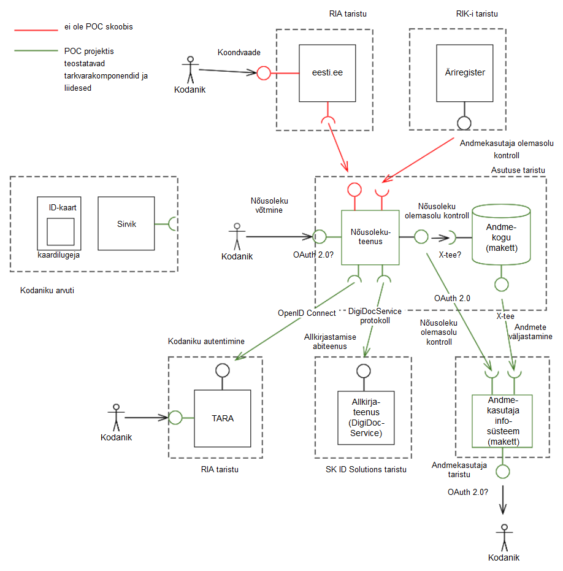

# Volli-POC
Nõusolekuteenuse *proof-of-concept* (POC).

Selgituseks: 

  Proof of concept (PoC) is a realization of a certain method or idea in order to demonstrate its feasibility, or a demonstration in principle with the aim of verifying that some concept or theory has practical potential. A proof of concept is usually small and may or may not be complete.

Töötav POC-rakendus: [https://volli-poc.herokuapp.com/](https://volli-poc.herokuapp.com/)

Taustateavet: https://github.com/e-gov/Volli-POC/wiki

Kontseptsioon:

Nõusolekuteenus on asutuse andmekogu juures evitatud e-teenus, millega:

- kodanik saab nõusolekuid anda, vaadata ja tagasi võtta;
- andmekasutaja saab vaadata temale andmete väljastamiseks antud nõusolekuid;
- andmekogu saab isikuandmete väljastamisel andmekasutajale kontrollida nõusoleku olemasolu.

Kasutusjuht. Nõusolekuteenuse kasutusjuhuks on olukord, kus:

- füüsiline isik, edaspidi kodanik,
- soovib anda nõusoleku, edaspidi nõusolek,
- tema kohta asutuse andmekogus hoitavatele andmetele, edaspidi isikuandmete,
- masinloetava juurdepääsu andmiseks
- kolmanda isiku, edaspidi andmekasutaja,
- infosüsteemile.

Andmekasutaja. Andmekasutaja on tüüpiliselt ettevõte, nt idufirma.

Nõusolekuteenuse tarkvara. Nõusolekuteenuse tarkvara peab pakkuma ülalnimetatud kasutusjuhu teostamiseks tõhusa ja korduvkasutatava tarkvaralise tehnilise lahenduse.

Asutus paigaldab nõusolekuteenuse tarkvarakomponendi ja liidestab selle asutuse ühe või mitme andmekoguga. Nõusolekuteenuse komponenti saab liidestada ka eesti.ee-s paikneva keskse komponendiga – koondvaateteenusega.

Nõusolekuteenuse komponent on tarkvararakendus, millel on:

- kasutajaliides, mille kaudu kodanik saab nõusolekuid anda, vaadata ja tagasi võtta
- andmebaas nõusolekute salvestamiseks
- masinliides nõusolekute väljastamiseks andmekasutajale
- seadistusliides
- liides Äriregistriga kolmandate isikute õigusliku seisundi kontrollimiseks
- liides autentimisteenusega TARA (https://www.ria.ee/et/riigi-infosusteem/eid/partnerile.html), kodaniku, vajadusel samuti andmekasutajat esindava füüsilise isiku autentimiseks.

Koondvaateteenus. Nõusolekuteenuse ökosüsteemi kuulub ka keskkomponent – nõusolekute koondvaateteenus. Keskkomponendi abil saavad nii kodanik kui ka andmekasutaja tutvuda kõigi kodaniku või andmekasutajaga seotud nõusolekutega. Keskkomponenti peab olema võimalik (vastava seadistuse abil) kasutada ka andmekaitseliseks järelevalveks.

Koondvaateteenus on teabeväravas eesti.ee-s paigaldatud tarkvararakendus, millel on:

- kasutajaliides
- masinliides asutustesse paigaldatud nõusolekuteenustega.

Koondvaateteenusega saab:

- kodanik koondvaate kõigist tema antud nõusolekutest
- andmekasutaja koondvaate kõigist temale antud nõusolekutest
- järelevalveasutus statistikat nõusolekute andmise kohta; vajadusel ka detailse vaate.

Kasutajaliides:

